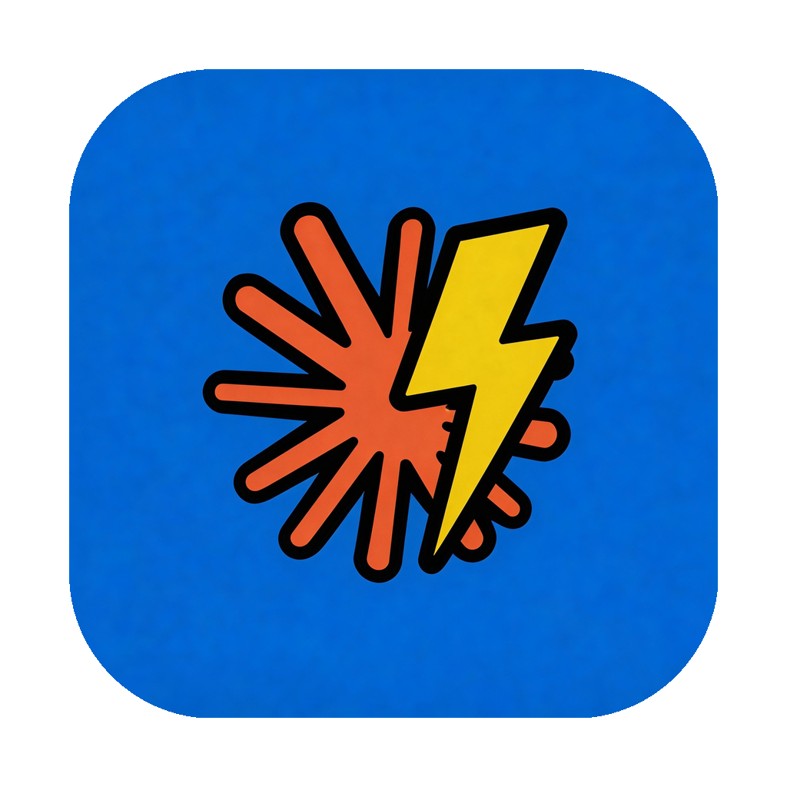
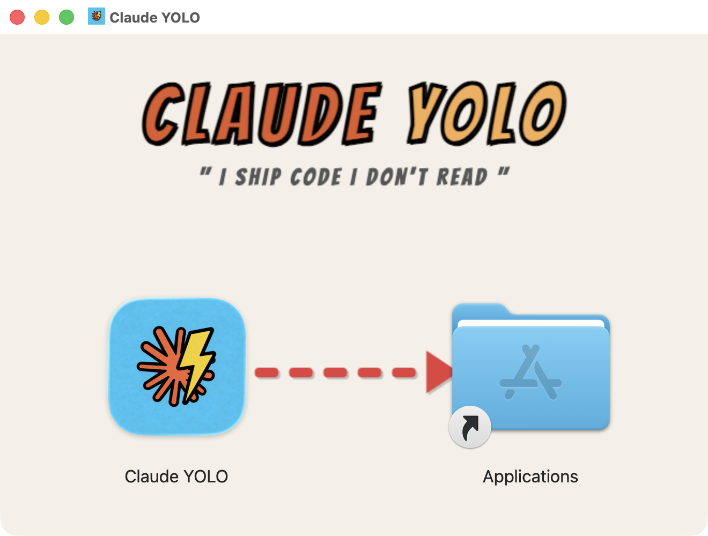
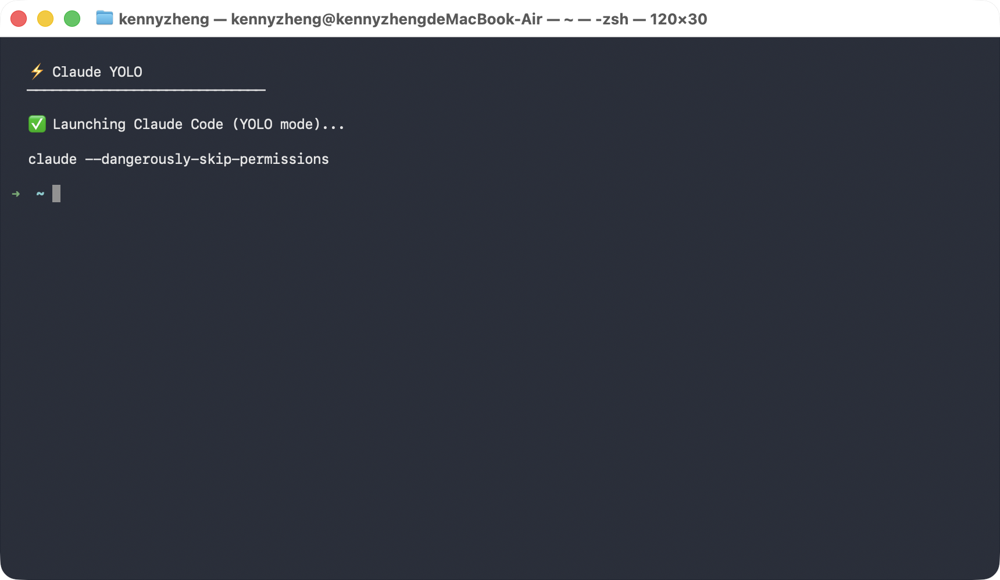

<p align="center">
  
</p>

<h1 align="center">Claude YOLO</h1>

<p align="center">
  <strong>I ship code, I don't read.</strong><br>
  One-click launcher for Claude Code with bypass permissions mode on macOS.
</p>

<p align="center">
  <a href="https://github.com/kenny-zheng-best/claude-yolo/releases">Download</a>
</p>

---

## Why This Exists

We're living through a shift in how code gets written.

**2021 — Copilot autocompletes a few words.** You type, it guesses the rest of the line. You're still the one writing code.

**2024 — Cursor completes sentences.** Press Tab, get a block. You're still reading every line, still driving.

**2025 — Claude Code writes entire features.** Multi-file changes, architecture decisions, test suites — all from a single prompt. The agent writes more code than you do. And honestly? It's often code you wouldn't even bother reading line by line, because **it just works**.

This is the moment Pieter Levels ([@levelsio](https://x.com/levelsio)) captured perfectly:

> **"I ship code, I don't read."**

The old workflow was: write code → run code → debug code. The new workflow is: **describe intent → review results → ship**. You don't need to micromanage every semicolon. You need to shape outcomes.

### The Problem

When you embrace this agent-first workflow with Claude Code, you quickly realize: **permission prompts are the bottleneck**, not the AI.

Claude Code's default mode asks for confirmation on every file edit, every shell command, every action. This makes sense for cautious exploration. But when you're in flow — when you trust the agent and just want results — it's like having a copilot who asks "are you sure?" before every turn of the steering wheel.

The solution is `--dangerously-skip-permissions` (a.k.a. YOLO mode). But:

- The command is long and impossible to remember
- Switching modes inside an existing Claude session (Shift+Tab) is unreliable
- You end up keeping the command in a notes app, copying and pasting it into terminal every time

**That's a terrible workflow for something you do dozens of times a day.**

### The Solution

**Claude YOLO** is a macOS app you put in your Dock. Click it, and you're instantly in a Claude Code session with bypass permissions on. No commands to remember. No mode switching. No friction.

One click. Full autonomy. Ship faster.

## Screenshots

### Drag to Install

<p align="center">
  
</p>

### One Click, YOLO Mode

<p align="center">
  
</p>

## Installation

1. **Download** `Claude-YOLO.dmg` from [Releases](https://github.com/kenny-zheng-best/claude-yolo/releases)
2. **Open** the DMG and drag **Claude YOLO** to your Applications folder
3. **Launch** from Applications or pin it to your Dock for one-click access

> **macOS says "damaged"?** Since the app isn't signed with an Apple Developer certificate, macOS may block it. Run this in Terminal:
> ```bash
> xattr -cr /Applications/Claude\ YOLO.app
> ```

### Prerequisites

- **macOS** (Intel & Apple Silicon)
- **Node.js** — if not installed, Claude YOLO will open the [download page](https://nodejs.org/) for you
- **Claude Code** — if not installed, Claude YOLO will install it automatically via npm
- **Anthropic API Key** or **Claude Pro / Max subscription**

## What It Does

When you click the app, it:

1. Opens a Terminal window
2. Checks that Node.js is available (guides you to install if missing)
3. Checks that Claude Code is available (auto-installs via `npm install -g @anthropic-ai/claude-code` if missing)
4. Launches `claude --dangerously-skip-permissions`
5. Auto-confirms the trust prompt (via `expect`, with graceful fallback)

That's it. You're in YOLO mode.

## FAQ

**Is this safe?**

YOLO mode gives Claude Code full autonomy — it can read, write, and execute anything on your machine without asking. Use it the same way you'd use `sudo`: with awareness. If you're working on a personal project and trust the agent, it's a massive productivity boost. If you're on a production server, maybe don't.

**Why a native app instead of a shell alias?**

Because a Dock icon is zero-friction. No terminal to open, no command to type or remember. It's the fastest path from "I have an idea" to "Claude is working on it."

**Can I customize the working directory?**

Claude YOLO opens in your home directory (`$HOME`) by default. Once in the session, use `/cd` or just ask Claude to navigate to your project.

## License

MIT
